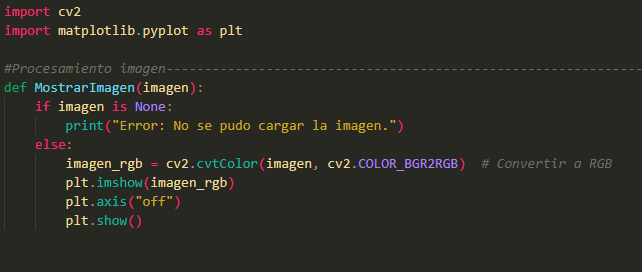
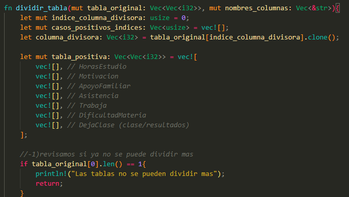
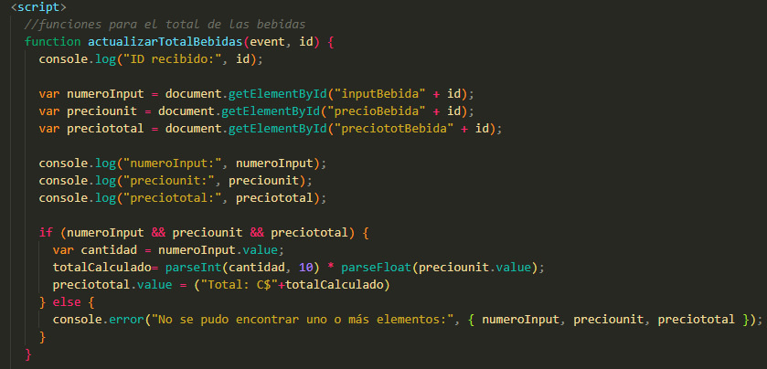
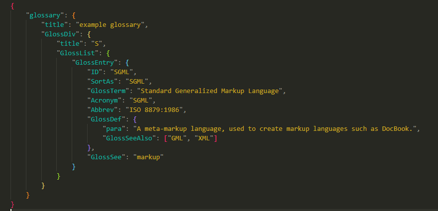

Basado en los colores de monokai pro (classic) pero con mas color en la syntaxis, tiene varias cosas específicas que puse a mano, por lo que puede que aún hayan errores con los colores en algunos lenguajes.

Lo hice pensando y teniendo especial cuidado para los lenguajes que mas uso/me gustan (Rust, Python, JS y todo lo relacionado a web) pero deberia servir para uso general siempre y cuando no usen un lenguaje super raro, incluso ajuste unas cosas para lenguajes que no uso, como C#.

Python:

Rust:

JavaScript:

Json:

probablemente le baje un poquito al rosado, en el futuro.

por: Hotep Ruiz, estudiante de ingenieria en computación, UNI Nicaragua

